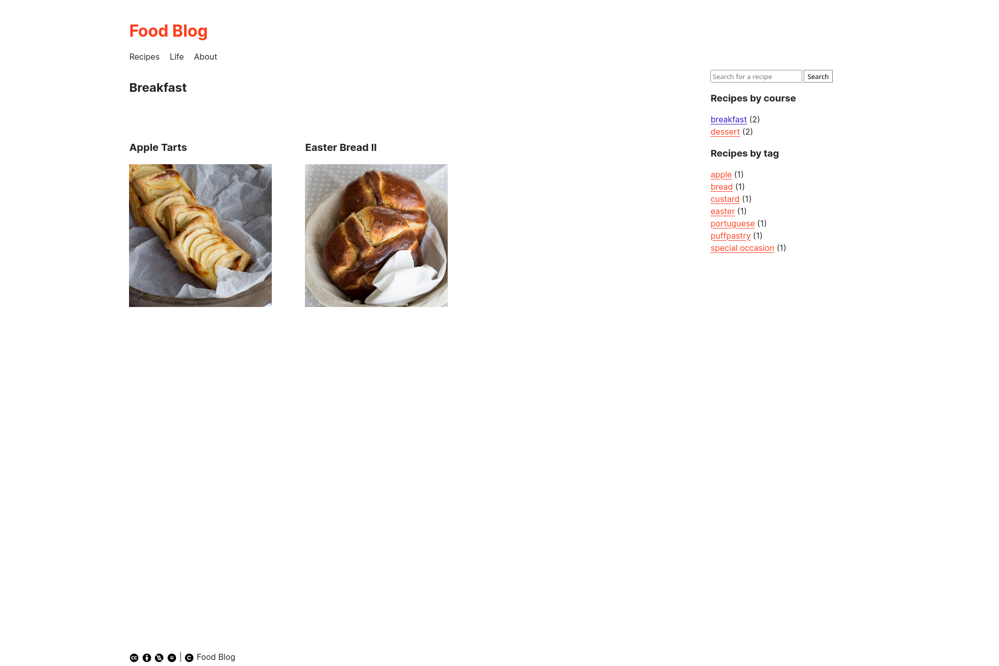

# Quiet Foodie

Clean and concise Hugo theme designed for creating a Food Blog. 

## Live demo

You can find a live demo on [github pages](https://paposeco.github.io/cleanhugotheme/), but for a full version you can check my own food blog [Punched Potatoes](https://punchedpotatoes.com).

## Main features

- No social media links or tracking of any kind. 
- If you choose to, you can create recipes with a [recipe schema markup](https://schema.org/Recipe) for better search engine results.
- By using tags and categories, recipes can easily be [browsed](https://www.punchedpotatoes.com/tags/special-occasion/) by the user.
- If you like to include a personal note on your recipes, you can hide it from your users by default, but still keep it in the blog post. 
- There's a Life section for personal posts and an About page.

## Getting started

### Installation

Create a new Hugo Site:

    hugo new site [path]

Inside the newly created directory in `[path]`, clone Quiet Foodie theme into the `/themes` directory:

    git clone https://github.com/paposeco/cleanhugotheme.git themes/quietfoodie

### Configuration

Edit hugo.toml to fit your blog and add the following:

    theme = "quietfoodie"
    # your name
    authorname = "Author"
    
    sectionPagesMenu = "main"
        paginate = 3

    [markup.goldmark.renderer]
        unsafe = true

    [params]
        mainSections = ['Recipes']
        authorname = "Author"
        # change to false if you don't want to use recipe schema markup
        recipeSchema = true

    [taxonomies]
        tag = "tags"
        course = "courses"

    [outputs]
        home = ["HTML", "JSON", "RSS"]

    [module]
        [module.hugoVersion]
        min = "0.41.0"
    # if your baseurl is not the site root, set canonifyurls to true (if you're hosting on github pages, for example)
    canonifyURLs = "false"

If you would like to have a favicon, place it inside `static/images` and name it favicon.ico.

## Add content

### Blog structure

Inside the `content` directory create a file named _index.md with the following content:

    ---
    weight: 130
    --- 

Inside the `content` directory create a directory called `recipes`. Create a file named _index.md inside the `recipes` directory with the following content:

    ---
    title: "Recipes"
    weight: 130
    ---

Optionally, if you would like to have a Life section on your blog, create a directory called `life` inside the `content` directory. Create a _index.md file inside the directory with the following content: 

    ---
    title: "Life"
    weight: 140
    ---

Posts on the Life section will not show up on the frontpage.

For the About page, create a directory called `about` inside the `content` directory. Create and index.md file with the following frontmatter:

    ---
    title: "About"
    menu: "main"
    type: "singlepage"
    ---

Finish writing your about page as you please.

### Actual content

Now that your blog structure is set up, you can start creating posts. 
- At the root of your hugo site, to create a new recipe with recipe schema markup, type 
    hugo new content --kind recipeschema recipes/nameofrecipe.md
- To create a new recipe without markup, type
    hugo new content recipes/nameofrecipe.md
- For a life post type
    hugo new content life/nameofpost.md

Place your images inside the `static/images` directory.

### Recipe schema markup

Check out the examples inside exampleSite for more details. By creating content using the archetypes as I described before, the recipe files created will be ready for you to fill them out. Shortcodes will be your friends.

 Don't forget to change draft to false when you are ready to publish!
